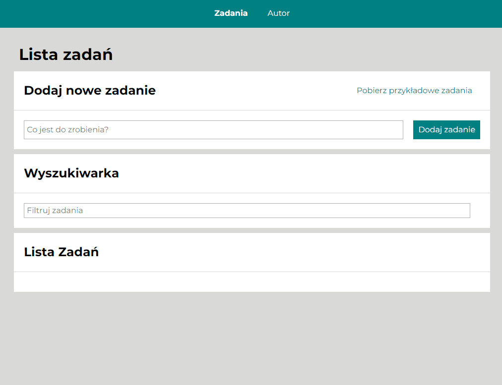

# Jakub Głuch - To do list in React.js + Vite



## Demo https://allmosthumann.github.io/todo-list-react/

## Introduction

In order to learn something new, I decided to rewrite my task list application to a TypeScript version. I used Vite as the builder. For styling, I used TailwindCSS. The main idea in this application was to add a server written in Express.js, and to use a MongoDB database, and to learn the Zustand library as a replacement for Redux. In addition, I made some changes to the look of the application, including adding the functionality to change the theme.

Learning Zustand, Express.js, and MongoDB will allow me to start writing a blockchain video playback application (Mirrorboards LFG!) in the near future.

Beyond that, it is still a simple task list application 😆.

Cheers!

## Description

Simple MERN To do list in React.js with TypeScript, with mobile devices responsiveness.

## Technologies

- React.js
- Vite
- TypeScript
- Zustand
- TanStack Query 5
- TailwindCSS
- React-router
- Axios
- TBA Express.js
- TBA MongoDB

# React + TypeScript + Vite

This template provides a minimal setup to get React working in Vite with HMR and some ESLint rules.

Currently, two official plugins are available:

- [@vitejs/plugin-react](https://github.com/vitejs/vite-plugin-react/blob/main/packages/plugin-react/README.md) uses [Babel](https://babeljs.io/) for Fast Refresh
- [@vitejs/plugin-react-swc](https://github.com/vitejs/vite-plugin-react-swc) uses [SWC](https://swc.rs/) for Fast Refresh

## Expanding the ESLint configuration

If you are developing a production application, we recommend updating the configuration to enable type aware lint rules:

- Configure the top-level `parserOptions` property like this:

```js
   parserOptions: {
    ecmaVersion: 'latest',
    sourceType: 'module',
    project: ['./tsconfig.json', './tsconfig.node.json'],
    tsconfigRootDir: __dirname,
   },
```

- Replace `plugin:@typescript-eslint/recommended` to `plugin:@typescript-eslint/recommended-type-checked` or `plugin:@typescript-eslint/strict-type-checked`
- Optionally add `plugin:@typescript-eslint/stylistic-type-checked`
- Install [eslint-plugin-react](https://github.com/jsx-eslint/eslint-plugin-react) and add `plugin:react/recommended` & `plugin:react/jsx-runtime` to the `extends` list
